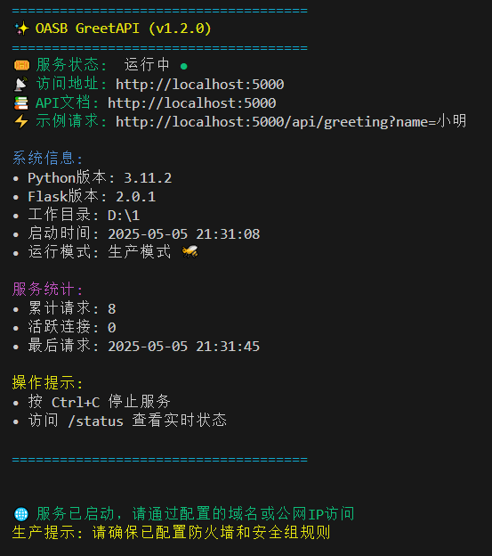
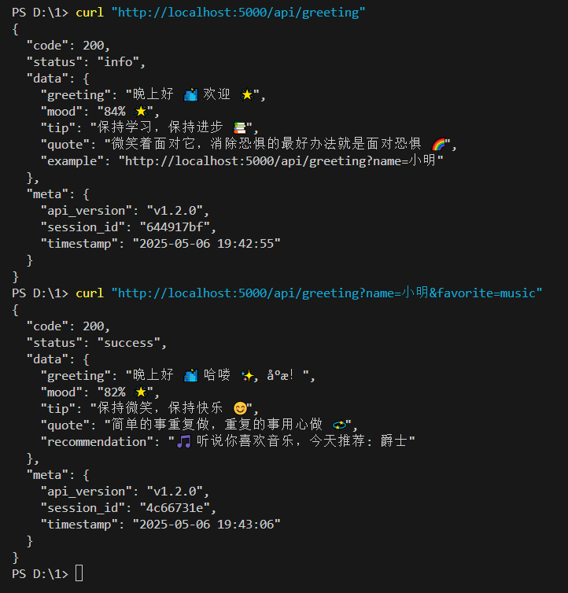
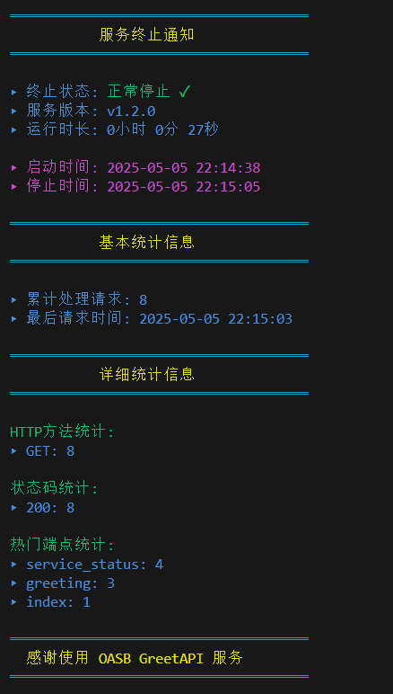

# OASB GreetAPI

OASB GreetAPI，一个基于Flask的智能问候服务平台API，专注于提供友好欢迎接口的开源项目，适用于各种应用程序，简化用户交互体验。

## 获取代码

### 方式一：直接下载
从github下载ZIP压缩包：
```bash
[https://github.com/oasb/greetapi/repository/archive/master.zip](https://github.com/oasbcn/OASBGreetAPI/archive/refs/heads/main.zip)
```

### 方式二：使用Git克隆
```bash
[git clone https://github.com/oasb/greetapi.git](https://github.com/oasbcn/OASBGreetAPI.git)
```

## 功能特性

- **智能时间问候**：根据当前时间返回不同的问候语（早上好/中午好/下午好/晚上好）
- **随机心情指数**：每次请求返回80-100之间的随机心情指数
- **每日温馨提示**：随机提供健康、工作、生活等方面的实用小贴士
- **名人名言**：随机返回励志格言
- **个性化推荐**：根据用户喜好参数返回定制化内容
- **服务状态监控**：实时跟踪服务运行状态和请求统计

## 统计信息持久化存储

### 统计文件说明
- 统计信息自动保存在临时文件中：`{tempfile.gettempdir()}/flask_api_stats.json`
- 文件格式为JSON，包含完整的服务运行统计
- 支持通过`--keep-stats`参数保留历史统计信息

### 统计文件格式
```json
{
  "start_time": "ISO格式时间",
  "total_requests": 总数,
  "last_request_time": "最后请求时间",
  "active_connections": 活跃连接数,
  "request_methods": {"GET": 数量, "POST": 数量},
  "status_codes": {"200": 数量, "404": 数量},
  "endpoints": {"/api/greeting": 调用次数},
  "errors": [{"time": "错误时间", "error": "错误信息"}]
}
```

## 新增功能：服务状态监控

### 服务状态监控接口

#### 统计功能说明
- 统计信息会自动保存到临时文件中，确保多进程间同步
- 默认情况下，服务重启时会重置统计信息
- 使用`--keep-stats`参数可以保留上次运行的统计信息

#### 使用示例
```bash
# 启动服务并保留统计信息
python main.py --keep-stats

# 启动服务并重置统计信息（默认行为）
python main.py
```

#### 状态监控接口
`/status`端点提供详细的统计信息：

```json
{
  "status": "running",
  "version": "v1.2.0",
  "start_time": "2023-11-15 14:20:10",
  
  "basic_stats": {
    "uptime": "0:10:32.123456",
    "total_requests": 42,
    "active_connections": 3,
    "last_request": "2023-11-15 14:30:22"
  },
  
  "detailed_stats": {
    "request_methods": {
      "GET": 35,
      "POST": 7
    },
    "status_codes": {
      "200": 38,
      "400": 3,
      "404": 1
    },
    "popular_endpoints": {
      "greeting": 25,
      "status": 10,
      "index": 7
    }
  },
  
  "recent_errors": [
    {
      "time": "2023-11-15 14:25:10",
      "error": "Invalid parameter: name cannot be empty"
    }
  ]
}
```

#### 统计信息说明

1. 基本统计（basic_stats）
   - `uptime`: 服务运行时长
   - `total_requests`: 总请求数
   - `active_connections`: 当前活跃连接数
   - `last_request`: 最后请求时间

2. 详细统计（detailed_stats）
   - `request_methods`: 各种HTTP方法的使用次数
   - `status_codes`: 各种HTTP状态码的出现次数
   - `popular_endpoints`: 最受欢迎的API端点及其访问次数

3. 错误记录（recent_errors）
   - 保留最近10条错误记录
   - 包含错误发生时间和错误信息

### 服务停止报告
当服务停止时，会显示详细的运行统计信息：

```
═════════════════════════════════════
           服务终止通知           
═════════════════════════════════════

▸ 终止状态: 正常停止 ✓
▸ 服务版本: v1.2.0
▸ 运行时长: 2小时 15分 30秒

▸ 启动时间: 2023-11-15 14:20:10
▸ 停止时间: 2023-11-15 16:35:40

═════════════════════════════════════
           服务统计信息           
═════════════════════════════════════

▸ 累计处理请求: 128
▸ 最后请求时间: 2023-11-15 16:35:22

═════════════════════════════════════
  感谢使用超级个性化问候API服务  
═════════════════════════════════════
```

### 监控端点

| 端点 | 方法 | 描述 |
|------|------|------|
| `/status` | GET | 获取服务运行状态和统计信息 |

### 服务状态字段说明

| 字段 | 类型 | 描述 |
|------|------|------|
| status | string | 服务状态(running/stopped) |
| uptime | string | 服务运行时长 |
| total_requests | integer | 累计处理请求数 |
| active_connections | integer | 当前活跃连接数 |
| last_request | string | 最后请求时间 |
| start_time | string | 服务启动时间 |
| version | string | API版本号 |

## 完整的命令行参数

| 参数 | 说明 | 默认值 |
|------|------|------|
| `--host` | 服务监听地址 | 0.0.0.0 |
| `--port` | 服务监听端口 | 5000 |
| `--debug` | 启用调试模式 | False |
| `--keep-stats` | 保留上次运行的统计信息 | False |

## 错误处理和故障排除 🔧

### 错误码说明

| 错误码 | 类型 | 说明 | 解决方案 |
|--------|------|------|----------|
| 400 | ValidationError | 请求参数验证失败 | 检查参数格式和值是否符合要求 |
| 404 | NotFoundError | 请求的资源不存在 | 确认API路径是否正确 |
| 429 | RateLimitError | 请求频率超限 | 降低请求频率或申请更高配额 |
| 500 | ServerError | 服务器内部错误 | 查看服务器日志或联系技术支持 |

### 常见问题解决

#### 1. 服务无法启动
- 检查端口是否被占用：
```bash
# Windows
netstat -ano | findstr :5000
# Linux/Mac
lsof -i :5000
```
- 确认Python环境和依赖是否正确安装
- 检查日志文件中的错误信息

#### 2. 响应速度慢
- 检查服务器负载情况
- 确认网络连接状态
- 查看缓存使用情况
- 考虑使用性能分析工具

#### 3. 请求失败
- 验证请求参数格式
- 检查网络连接
- 查看服务器日志
- 确认API版本兼容性

### 日志说明

#### 日志位置
- 应用日志：`./logs/app.log`
- 错误日志：`./logs/error.log`
- 访问日志：`./logs/access.log`

#### 日志格式
```
[时间戳] [日志级别] [请求ID] 消息内容
```

#### 日志级别
- DEBUG：调试信息
- INFO：一般信息
- WARNING：警告信息
- ERROR：错误信息
- CRITICAL：严重错误

### 监控建议

1. 系统监控
   - CPU使用率
   - 内存占用
   - 磁盘空间
   - 网络流量

2. 应用监控
   - 请求响应时间
   - 错误率
   - 并发连接数
   - 缓存命中率

3. 日志监控
   - 错误日志频率
   - 异常类型统计
   - 性能指标趋势
   - 访问模式分析

## 生产环境建议

1. 使用Nginx作为反向代理
2. 启用`--keep-stats`参数持久化统计信息
3. 监控`/status`端点获取服务健康状态
4. 定期检查错误日志
5. 建议使用Gunicorn或uWSGI作为WSGI服务器
6. 配置日志轮转防止日志文件过大

## 开发说明

- 统计信息在多进程间自动同步
- 所有请求都会被记录，包括静态文件请求
- 调试模式下会显示更详细的日志信息
- 项目使用以下技术栈：
  - Python 3.7+
  - Flask框架
  - Flask-Caching扩展
  - Colorama终端颜色输出

## 效果预览




*服务启动界面展示*



*API调用效果展示*



*服务状态监控界面*

## 配置说明 ⚙️

### 配置文件
项目根目录下的`config.json`文件用于配置服务的各项参数。你可以复制`config.example.json`并重命名为`config.json`来开始配置：

```bash
cp config.example.json config.json
```

### 配置项说明

#### 1. 服务器配置 (server)
```json
{
  "server": {
    "host": "0.0.0.0",    // 服务监听地址
    "port": 5000,         // 服务端口
    "debug": false,       // 是否开启调试模式
    "keep_stats": true    // 是否保留统计信息
  }
}
```

#### 2. 日志配置 (logging)
```json
{
  "logging": {
    "level": "INFO",      // 日志级别
    "format": "[%(asctime)s] %(levelname)s: %(message)s",
    "file": {
      "enabled": true,    // 是否启用文件日志
      "path": "./logs/app.log",
      "max_size": "10MB", // 单个日志文件最大大小
      "backup_count": 5   // 保留的日志文件数量
    }
  }
}
```

#### 3. 缓存配置 (cache)
```json
{
  "cache": {
    "enabled": true,      // 是否启用缓存
    "type": "simple",     // 缓存类型
    "default_timeout": 300, // 缓存过期时间（秒）
    "threshold": 500      // 缓存条目数上限
  }
}
```

#### 4. API配置 (api)
```json
{
  "api": {
    "version": "v1.2.0",  // API版本
    "rate_limit": {
      "enabled": true,    // 是否启用请求限制
      "requests": 60,     // 允许的请求数
      "per_minutes": 1    // 时间窗口（分钟）
    }
  }
}
```

#### 5. 功能配置 (features)
```json
{
  "features": {
    "emoji_enabled": true,     // 是否启用表情
    "quote_language": "zh",    // 名言语言
    "tips_enabled": true,      // 是否启用提示
    "mood_index": true        // 是否启用心情指数
  }
}
```

### 环境变量配置
除了使用配置文件，你也可以使用环境变量来覆盖配置：

```bash
# 服务器配置
export API_HOST=0.0.0.0
export API_PORT=5000
export API_DEBUG=false

# 日志配置
export LOG_LEVEL=INFO
export LOG_FILE_ENABLED=true

# 缓存配置
export CACHE_ENABLED=true
export CACHE_TIMEOUT=300

# 功能开关
export EMOJI_ENABLED=true
export TIPS_ENABLED=true
```

## 快速开始

### 获取代码

#### 方式一：直接下载
从github下载ZIP压缩包：
```bash
[https://github.com/oasb/greetapi/repository/archive/master.zip](https://github.com/oasbcn/OASBGreetAPI/archive/refs/heads/main.zip)
```

#### 方式二：使用Git克隆
```bash
[git clone https://github.com/oasb/greetapi.git](https://github.com/oasbcn/OASBGreetAPI.git)
```

### 安装方式

#### 方式一：直接安装（简单方式）
```bash
# 直接安装所需依赖
pip install flask flask-caching colorama pytz
```

#### 方式二：使用虚拟环境（推荐方式）
```bash
# 1. 创建虚拟环境
python -m venv venv

# 2. 激活虚拟环境
# Windows系统:
venv\Scripts\activate
# Linux/Mac系统:
source venv/bin/activate

# 3. 安装依赖
pip install flask flask-caching colorama pytz

# 4. 退出虚拟环境（使用完毕后）
deactivate
```

### 环境要求
- Python 3.7+
- pip 20.0+
- Windows/Linux/MacOS 均可运行

### 依赖说明
- `flask`: Web框架核心包
- `flask-caching`: Flask的缓存扩展
- `pytz`: 时区处理库
- `colorama`: 终端颜色支持

### 注意事项

#### 使用虚拟环境的优势
1. 项目依赖隔离，避免版本冲突
2. 便于管理不同项目的依赖
3. 方便迁移和部署
4. 不影响系统的Python环境

#### 直接安装的注意事项
1. 依赖会安装到系统的Python环境中
2. 可能与其他项目的依赖产生冲突
3. 适合快速测试或临时使用

#### 常见问题解决
1. 如果安装时提示权限错误：
   ```bash
   # Windows下使用管理员权限运行
   # Linux/Mac下使用sudo
   sudo pip install flask flask-caching colorama pytz
   ```

2. 如果提示pip命令未找到：
   ```bash
   # 确保pip已安装
   python -m ensurepip --upgrade
   ```

3. 如果遇到版本冲突：
   ```bash
   # 使用虚拟环境可以避免此问题
   # 或者使用以下命令强制更新
   pip install --upgrade flask flask-caching colorama pytz
   ```

注意：其他导入的模块（如json、tempfile、random等）都是Python标准库的一部分，无需额外安装。

## 启动服务

### 基本启动
```bash
# 使用默认配置启动
python main.py

# 指定端口启动
python main.py --port 8080

# 指定主机和端口启动
python main.py --host 0.0.0.0 --port 8080
```

### 启动参数说明
- `--host`: 指定主机地址，默认为 127.0.0.1
- `--port`: 指定端口号，默认为 5000
- `--debug`: 启用调试模式，显示详细日志

## 使用示例

### 1. 获取问候语
```bash
# 使用curl发送请求
curl http://localhost:5000/api/v1/greet

# 返回示例
{
    "greeting": "下午好！今天阳光明媚，愿你心情愉悦！",
    "mood_index": 85,
    "quote": "生活中最美好的事物都是免费的。",
    "timestamp": "2024-01-01 14:30:00"
}
```

### 2. 查看服务状态
```bash
# 访问状态监控接口
curl http://localhost:5000/api/v1/status

# 返回示例
{
    "status": "running",
    "uptime": "2h 30m",
    "requests_total": 1500,
    "cache_hits": 450,
    "system_load": "normal"
}
```

### 3. 自定义问候
```bash
# 发送带参数的请求
curl "http://localhost:5000/api/v1/greet?name=小明"

# 返回示例
{
    "greeting": "下午好，小明！祝你度过愉快的一天！",
    "mood_index": 90,
    "quote": "微笑是最好的名片。",
    "timestamp": "2024-01-01 14:35:00"
}
```

## 监控和维护

### 查看服务日志
```bash
# 日志文件位于 logs 目录
tail -f logs/app.log
```

### 性能监控
- 访问 `/api/v1/status` 查看实时状态
- 查看 `logs/performance.log` 了解详细性能指标
- 监控缓存命中率和系统负载

### 故障排除
1. 如果服务无法启动，检查：
   - 端口是否被占用
   - 权限是否足够
   - 依赖是否安装完整

2. 如果响应较慢，检查：
   - 系统负载情况
   - 缓存使用情况
   - 网络连接状态

## API 文档

### 基础信息
- 基础URL：`http://localhost:5000`
- 版本：v1
- 响应格式：JSON
- 编码：UTF-8

### 接口列表

#### 1. 获取问候语
```http
GET /api/v1/greet
```

**参数：**
| 参数名 | 类型 | 必选 | 描述 |
|--------|------|------|------|
| name | string | 否 | 自定义问候对象名称 |
| lang | string | 否 | 语言代码(zh/en)，默认zh |

**响应示例：**
```json
{
    "greeting": "早上好！愿你的一天充满活力！",
    "mood_index": 85,
    "quote": "每一个日出都是新的开始。",
    "timestamp": "2024-01-01 08:30:00"
}
```

#### 2. 获取服务状态
```http
GET /api/v1/status
```

**响应示例：**
```json
{
    "status": "running",
    "uptime": "2h 30m",
    "requests": {
        "total": 1500,
        "success": 1495,
        "error": 5
    },
    "cache": {
        "hits": 450,
        "misses": 1050,
        "hit_rate": "30%"
    },
    "system": {
        "load": "normal",
        "memory_usage": "45%",
        "cpu_usage": "30%"
    }
}
```

### 错误码说明

| 错误码 | 描述 | 解决方案 |
|--------|------|----------|
| 200 | 请求成功 | - |
| 400 | 参数错误 | 检查请求参数是否正确 |
| 429 | 请求过于频繁 | 降低请求频率 |
| 500 | 服务器内部错误 | 查看服务器日志或联系管理员 |

### 请求限制
- 每个IP每分钟最多60次请求
- 缓存时间：30秒
- 最大响应时间：2秒

### 最佳实践
1. 使用合适的缓存策略
2. 处理可能的错误响应
3. 实现请求重试机制
4. 监控API使用情况

### 更新日志
- v1.2.0: 添加多语言支持
- v1.1.0: 添加自定义名称功能
- v1.0.0: 初始版本发布

## 参与贡献

我们欢迎所有形式的贡献，无论是新功能、bug修复还是文档改进。

### 贡献步骤

1. Fork 项目
2. 创建新的分支
   ```bash
   git checkout -b feature/your-feature
   ```
3. 提交你的修改
   ```bash
   git commit -m 'Add some feature'
   ```
4. 推送到分支
   ```bash
   git push origin feature/your-feature
   ```
5. 创建 Pull Request

### 开发指南

1. 代码风格
   - 遵循 PEP 8 规范
   - 使用清晰的变量和函数命名
   - 添加必要的注释
   - 保持代码简洁

2. 提交规范
   - feat: 新功能
   - fix: 修复bug
   - docs: 文档更新
   - style: 代码格式化
   - refactor: 代码重构
   - test: 测试相关
   - chore: 其他修改

3. 测试要求
   - 添加单元测试
   - 确保所有测试通过
   - 测试覆盖率不低于80%

### 问题反馈

- 使用 GitHub Issues 提交问题
- 描述清楚问题的复现步骤
- 提供必要的环境信息
- 附上相关的日志或截图


## 联系我们

- 项目主页：https://github.com/oasb/greetapi
- 问题反馈：https://github.com/oasb/greetapi/issues
- 技术支持：support@api.oasb.cn

### 服务启动

#### 开发环境 (带调试功能)
```bash
python main.py --debug
```
特点：
- 自动重载代码修改
- 显示详细错误信息
- 输出更多调试日志

#### 生产环境 (推荐配置)
```bash
python main.py --host 0.0.0.0 --port 5000
```
特点：
- 更高性能
- 更安全
- 适合长期运行

#### 常用参数说明
| 参数 | 说明 | 默认值 | 示例 |
|------|------|-------|------|
| `--host` | 监听地址 | 127.0.0.1 | `--host 0.0.0.0` |
| `--port` | 监听端口 | 5000 | `--port 8080` |
| `--debug` | 调试模式 | False | `--debug` |
| `--keep-stats` | 保留统计 | False | `--keep-stats` |

#### 典型场景示例

1. 本地开发测试：
```bash
python main.py --debug --port 8000
```

2. 生产环境部署：
```bash
python main.py --host 0.0.0.0 --port 80 --keep-stats
```

3. 查看帮助：
```bash
python main.py --help
```

3. 访问API：

本地访问：
```
http://localhost:5000/api/greeting?name=小明
```

从其他设备访问：
```
http://<服务器IP>:5000/api/greeting?name=小明
```

注意事项：
- 确保防火墙允许对应端口的访问
- 如果使用云服务器，需要在安全组中开放对应端口
- 建议在生产环境中使用反向代理（如Nginx）来提供服务

## API文档 🚀

### 基础问候接口

#### 请求信息
- **接口**: `/api/greeting`
- **方法**: GET
- **描述**: 获取个性化的问候语和推荐内容

#### 请求参数

| 参数名 | 类型 | 必填 | 说明 | 示例 |
|--------|------|------|------|------|
| name | string | 否 | 用户名称 | 小明 |
| favorite | string | 否 | 用户兴趣（可选值：music/sports/food） | music |

#### 响应格式

**成功响应** (200 OK)
```json
{
  "code": 200,
  "status": "success",
  "data": {
    "greeting": "下午好 🌤️ 很高兴见到你 🌈, 小明！",
    "mood": "92% 😊",
    "tip": "记得喝水哦 💧",
    "quote": "生活就像一盒巧克力，你永远不知道下一块是什么味道 🍫",
    "recommendation": "🎵 听说你喜欢音乐，今天推荐: 《平凡之路》"
  },
  "meta": {
    "api_version": "v1.2.0",
    "session_id": "a1b2c3d4",
    "timestamp": "2024-11-15 14:30:22"
  }
}
```

**错误响应** (400 Bad Request)
```json
{
  "code": 400,
  "status": "error",
  "error": {
    "type": "ValidationError",
    "message": "参数错误",
    "details": "favorite参数只能是music/sports/food中的一个"
  }
}
```

#### 调用示例

**Python**
```python
import requests

def get_greeting(name=None, favorite=None):
    params = {}
    if name:
        params['name'] = name
    if favorite:
        params['favorite'] = favorite
    
    response = requests.get(
        'http://localhost:5000/api/greeting',
        params=params
    )
    return response.json()

# 基础调用
print(get_greeting())

# 带参数调用
print(get_greeting(name="小明", favorite="music"))
```

**JavaScript**
```javascript
// 使用Fetch API
async function getGreeting(name, favorite) {
  const params = new URLSearchParams();
  if (name) params.append('name', name);
  if (favorite) params.append('favorite', favorite);

  const response = await fetch(
    `http://localhost:5000/api/greeting?${params.toString()}`
  );
  return await response.json();
}

// 基础调用
getGreeting().then(console.log);

// 带参数调用
getGreeting('小明', 'music').then(console.log);
```

**curl**
```bash
# 基础调用
curl "http://localhost:5000/api/greeting"

# 带参数调用
curl "http://localhost:5000/api/greeting?name=小明&favorite=music"
```

## 贡献指南

欢迎提交Pull Request或Issue报告问题。

## 许可证

MIT
