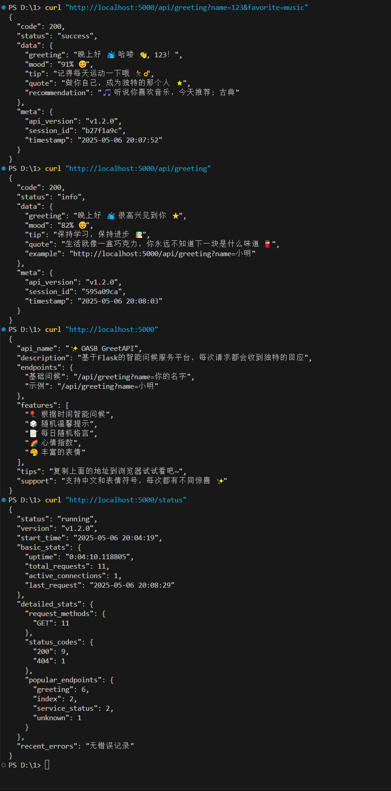

# OASB GreetAPI

OASB GreetAPI，一个基于Flask的智能问候服务平台API，专注于提供友好欢迎接口的开源项目，适用于各种应用程序，简化用户交互体验。

## 获取代码

### 方式一：直接下载
从Gitee下载ZIP压缩包：
```bash
https://gitee.com/yeink/greetapi/repository/archive/master.zip
```

### 方式二：使用Git克隆
```bash
git clone https://gitee.com/yeink/greetapi.git
```

## 功能特性

- **智能时间问候**：根据当前时间返回不同的问候语（早上好/中午好/下午好/晚上好）
- **随机心情指数**：每次请求返回80-100之间的随机心情指数
- **每日温馨提示**：随机提供健康、工作、生活等方面的实用小贴士
- **名人名言**：随机返回励志格言
- **个性化推荐**：根据用户喜好参数返回定制化内容
- **服务状态监控**：实时跟踪服务运行状态和请求统计
- **跨平台兼容**：支持Windows、Linux、MacOS等多个平台
- **文件操作安全**：实现跨平台文件锁机制，确保数据一致性
- **并发请求处理**：支持多进程安全的统计信息存储
- **Unicode支持**：完整的中文和表情符号支持
- **缓存优化**：智能的请求缓存机制
- **安全响应头**：配置了完整的安全响应头

## 安全特性

### 文件操作安全性
- 使用FileLock类实现跨平台文件锁
- 支持Windows (msvcrt) 和 Unix (fcntl) 的文件锁机制
- 使用临时文件和原子性重命名确保写入安全
- 完整的异常处理和资源清理机制

### 数据一致性保护
- 防止多进程/线程并发写入问题
- 使用UTF-8编码确保中文正确处理
- 临时文件机制确保写入原子性
- 自动清理机制防止资源泄露

### 安全响应头配置
- X-Content-Type-Options: nosniff
- X-Frame-Options: DENY
- X-XSS-Protection: 1; mode=block
- Strict-Transport-Security
- Content-Security-Policy

## 跨平台兼容性

### 终端显示优化
- Windows系统自动配置控制台编码
- 使用colorama确保彩色输出兼容性
- 根据系统类型选择合适的表情符号显示
- 自适应的Unicode字符处理

### 文件系统处理
- 统一使用UTF-8编码处理文件
- 适配不同操作系统的文件路径
- 处理文件锁的平台差异
- 安全的临时文件处理机制

### 字符编码处理
- 请求参数UTF-8编码验证
- 响应头正确设置字符集
- JSON响应支持中文字符
- 跨平台的日志编码处理

## 日志系统

### 日志配置
- 分级的日志记录机制
- 彩色终端输出支持
- 自定义日志过滤器
- 跨平台的日志格式化

### 日志分类
1. 应用日志
   - 服务启动和停止信息
   - 配置加载状态
   - 重要操作记录

2. 请求日志
   - 访问记录
   - 响应状态
   - 处理时间
   - 错误追踪

3. 错误日志
   - 异常堆栈
   - 错误详情
   - 上下文信息
   - 调试数据

### 日志输出格式
```
[时间戳] [日志级别] [进程ID] 消息内容
示例：[2024-01-15 14:30:22] [INFO] [12345] 服务启动成功
```

## 统计信息持久化存储

### 统计文件说明
- 统计信息自动保存在临时文件中：`{tempfile.gettempdir()}/flask_api_stats.json`
- 使用FileLock确保多进程安全访问
- 支持通过`--keep-stats`参数保留历史统计信息
- 文件操作采用原子写入机制

### 统计文件格式
```json
{
  "start_time": "ISO格式时间",
  "total_requests": 总数,
  "last_request_time": "最后请求时间",
  "active_connections": 活跃连接数,
  "request_methods": {"GET": 数量, "POST": 数量},
  "status_codes": {"200": 数量, "404": 数量},
  "endpoints": {"/api/greeting": 调用次数},
  "errors": [{"time": "错误时间", "error": "错误信息"}]
}
```

## 新增功能：服务状态监控

### 服务状态监控接口

#### 性能监控
- **实时性能指标**
  - CPU使用率监控
  - 内存使用情况
  - 磁盘I/O统计
  - 响应时间分析

- **安全统计**
  - 请求限流统计
  - 可疑请求记录
  - IP封禁情况
  - 安全事件追踪

#### 统计功能说明
- 统计信息会自动保存到临时文件中，确保多进程间同步
- 默认情况下，服务重启时会重置统计信息
- 使用`--keep-stats`参数可以保留上次运行的统计信息
- 支持性能指标和安全事件的持久化存储

#### 使用示例
```bash
# 启动服务并保留统计信息
python main.py --keep-stats

# 启动服务并重置统计信息（默认行为）
python main.py
```

#### 状态监控接口
`/status`端点提供详细的统计信息：

```json
{
  "status": "running",
  "version": "v1.3.0",
  "start_time": "2024-01-15 14:20:10",
  
  "basic_stats": {
    "uptime": "0:10:32.123456",
    "total_requests": 42,
    "active_connections": 3,
    "last_request": "2024-01-15 14:30:22"
  },
  
  "detailed_stats": {
    "request_methods": {
      "GET": 35,
      "POST": 7
    },
    "status_codes": {
      "200": 38,
      "400": 3,
      "404": 1
    },
    "popular_endpoints": {
      "greeting": 25,
      "status": 10,
      "index": 7
    }
  },
  
  "system_metrics": {
    "cpu_usage": "23.5%",
    "memory_usage": "156.2MB",
    "disk_io": {
      "read_speed": "2.5MB/s",
      "write_speed": "1.2MB/s",
      "read_count": 1250,
      "write_count": 380
    }
  },
  
  "recent_errors": [
    {
      "time": "2024-01-15 14:25:10",
      "error": "Invalid parameter: name cannot be empty",
      "trace_id": "abc123",
      "context": {
        "request_path": "/api/greeting",
        "client_ip": "192.168.1.100"
      }
    }
  ]
}
```

#### 系统资源指标说明

| 指标 | 描述 | 正常范围 |
|------|------|----------|
| cpu_usage | CPU使用率 | <50% |
| memory_usage | 内存使用量 | <500MB |
| disk_io.read_speed | 磁盘读取速度 | <10MB/s |
| disk_io.write_speed | 磁盘写入速度 | <5MB/s |
| disk_io.read_count | 磁盘读取次数 | - |
| disk_io.write_count | 磁盘写入次数 | - |

#### 性能指标说明

| 指标 | 描述 | 正常范围 |
|------|------|----------|
| cpu_usage | CPU使用率 | <50% |
| memory_usage | 内存使用量 | <500MB |
| response_times.avg | 平均响应时间 | <100ms |
| response_times.p95 | 95%请求的响应时间 | <200ms |
| response_times.p99 | 99%请求的响应时间 | <500ms |

#### 安全统计说明

| 指标 | 描述 | 警告阈值 |
|------|------|----------|
| rate_limited_requests | 被限流的请求数 | >10/小时 |
| blocked_ips | 被封禁的IP数量 | >5个活跃封禁 |
| suspicious_activities | 可疑活动记录 | >10/小时 |

#### 统计信息说明

1. 基本统计（basic_stats）
   - `uptime`: 服务运行时长
   - `total_requests`: 总请求数
   - `active_connections`: 当前活跃连接数
   - `last_request`: 最后请求时间

2. 详细统计（detailed_stats）
   - `request_methods`: 各种HTTP方法的使用次数
   - `status_codes`: 各种HTTP状态码的出现次数
   - `popular_endpoints`: 最受欢迎的API端点及其访问次数

3. 错误记录（recent_errors）
   - 保留最近10条错误记录
   - 包含错误发生时间和错误信息

### 服务停止报告
当服务停止时，会显示详细的运行统计信息：

```
═════════════════════════════════════
           服务终止通知           
═════════════════════════════════════

▸ 终止状态: 正常停止 ✓
▸ 服务版本: v1.2.0
▸ 运行时长: 2小时 15分 30秒

▸ 启动时间: 2023-11-15 14:20:10
▸ 停止时间: 2023-11-15 16:35:40

═════════════════════════════════════
           服务统计信息           
═════════════════════════════════════

▸ 累计处理请求: 128
▸ 最后请求时间: 2023-11-15 16:35:22

═════════════════════════════════════
  感谢使用超级个性化问候API服务  
═════════════════════════════════════
```

### 监控端点

| 端点 | 方法 | 描述 |
|------|------|------|
| `/status` | GET | 获取服务运行状态和统计信息 |

### 服务状态字段说明

| 字段 | 类型 | 描述 |
|------|------|------|
| status | string | 服务状态(running/stopped) |
| uptime | string | 服务运行时长 |
| total_requests | integer | 累计处理请求数 |
| active_connections | integer | 当前活跃连接数 |
| last_request | string | 最后请求时间 |
| start_time | string | 服务启动时间 |
| version | string | API版本号 |

## 完整的命令行参数

| 参数 | 说明 | 默认值 |
|------|------|------|
| `--host` | 服务监听地址 | 0.0.0.0 |
| `--port` | 服务监听端口 | 5000 |
| `--debug` | 启用调试模式 | False |
| `--keep-stats` | 保留上次运行的统计信息 | False |

## 错误处理和故障排除 🔧

### 错误码说明

| 错误码 | 类型 | 说明 | 解决方案 |
|--------|------|------|----------|
| 400 | ValidationError | 请求参数验证失败 | 检查参数格式和值是否符合要求 |
| 404 | NotFoundError | 请求的资源不存在 | 确认API路径是否正确 |
| 429 | RateLimitError | 请求频率超限 | 降低请求频率或申请更高配额 |
| 500 | ServerError | 服务器内部错误 | 查看服务器日志或联系技术支持 |

### 常见问题解决

#### 1. 服务无法启动
- 检查端口是否被占用：
```bash
# Windows
netstat -ano | findstr :5000
# Linux/Mac
lsof -i :5000
```
- 确认Python环境和依赖是否正确安装
- 检查日志文件中的错误信息

#### 2. 响应速度慢
- 检查服务器负载情况
- 确认网络连接状态
- 查看缓存使用情况
- 考虑使用性能分析工具

#### 3. 请求失败
- 验证请求参数格式
- 检查网络连接
- 查看服务器日志
- 确认API版本兼容性

### 日志说明

#### 日志位置
- 应用日志：`./logs/app.log`
- 错误日志：`./logs/error.log`
- 访问日志：`./logs/access.log`

#### 日志格式
```
[时间戳] [日志级别] [请求ID] 消息内容
```

#### 日志级别
- DEBUG：调试信息
- INFO：一般信息
- WARNING：警告信息
- ERROR：错误信息
- CRITICAL：严重错误

### 监控建议

1. 系统监控
   - CPU使用率
   - 内存占用
   - 磁盘空间
   - 网络流量

2. 应用监控
   - 请求响应时间
   - 错误率
   - 并发连接数
   - 缓存命中率

3. 日志监控
   - 错误日志频率
   - 异常类型统计
   - 性能指标趋势
   - 访问模式分析

## 生产环境建议

1. 使用Nginx作为反向代理
2. 启用`--keep-stats`参数持久化统计信息
3. 监控`/status`端点获取服务健康状态
4. 定期检查错误日志
5. 建议使用Gunicorn或uWSGI作为WSGI服务器
6. 配置日志轮转防止日志文件过大

## 开发说明

- 统计信息在多进程间自动同步
- 所有请求都会被记录，包括静态文件请求
- 调试模式下会显示更详细的日志信息
- 项目使用以下技术栈：
  - Python 3.7+
  - Flask框架
  - Flask-Caching扩展
  - Colorama终端颜色输出

## 效果预览


*服务启动界面展示*



*API调用效果展示*


*服务状态监控界面*

## 配置管理 ⚙️

### 快速开始

#### 1. 创建新配置
```bash
python scripts/config_manager.py --create config.json
```

#### 2. 验证配置
```bash
python scripts/config_manager.py --validate config.json
```

#### 3. 使用示例配置
```bash
cp config.example.json config.json
```

### 配置说明文档

详细的配置项说明请参考：[CONFIG_DESCRIPTION.md](CONFIG_DESCRIPTION.md)

该文档包含：
- 所有配置项的详细说明
- 每个字段的类型和默认值
- 配置项的最佳实践建议
- 安全相关的配置建议

### 工具脚本说明

项目提供了多个实用脚本，位于`scripts/`目录下：

| 脚本名称 | 功能描述 | 使用示例 |
|----------|----------|----------|
| config_manager.py | 配置管理工具 | `python scripts/config_manager.py -v config.json` |
| analyze_monitoring.py | 监控数据分析 | `python scripts/analyze_monitoring.py --days 7` |
| monitor_resources.py | 实时资源监控 | `python scripts/monitor_resources.py` |

详细文档请参考[scripts/README.md](scripts/README.md)

### 配置验证规则

- **服务器配置**:
  - 端口范围: 1-65535
  - 生产环境禁用debug模式
  - 监听地址建议使用0.0.0.0

- **日志配置**:
  - 有效日志级别: DEBUG/INFO/WARNING/ERROR/CRITICAL
  - 日志文件路径必须有效
  - 建议启用日志轮转

- **监控配置**:
  - 监控间隔≥10秒
  - 数据保留天数≤90
  - 必须指定存储目录

- **安全配置**:
  - 建议启用所有安全头部
  - 请求限制建议30-1000/分钟
  - 必须启用XSS保护

### 配置管理工具功能

#### 1. 配置文件验证
- 检查JSON格式是否正确
- 验证各配置项的有效性
- 检查端口范围、日志级别等关键参数
- 提供配置合理性建议

#### 2. 配置生成向导
- 交互式创建配置文件
- 提供默认值和选项提示
- 自动验证输入的有效性
- 生成格式规范的配置文件

#### 3. 配置检查报告
- 显示配置错误和警告
- 提供改进建议
- 输出验证结果状态

### 配置项说明

| 配置项 | 类型 | 默认值 | 说明 |
|--------|------|--------|------|
| server.host | string | "0.0.0.0" | 服务监听地址 |
| server.port | int | 5000 | 服务监听端口 |
| server.debug | bool | false | 是否启用调试模式 |
| logging.level | string | "INFO" | 日志级别 |
| logging.file.enabled | bool | true | 是否启用文件日志 |
| monitoring.enabled | bool | true | 是否启用监控 |
| security.rate_limit.enabled | bool | true | 是否启用请求限制 |

### 最佳实践
1. 生产环境应禁用debug模式
2. 建议设置合理的请求限制
3. 监控间隔不宜过短(建议≥10秒)
4. 日志文件应定期轮转
5. 重要配置变更后应重新验证

### 配置项说明

#### 1. 服务器配置 (server)
```json
{
  "server": {
    "host": "0.0.0.0",    // 服务监听地址
    "port": 5000,         // 服务端口
    "debug": false,       // 是否开启调试模式
    "keep_stats": true    // 是否保留统计信息
  }
}
```

#### 2. 日志配置 (logging)
```json
{
  "logging": {
    "level": "INFO",      // 日志级别
    "format": "[%(asctime)s] %(levelname)s: %(message)s",
    "file": {
      "enabled": true,    // 是否启用文件日志
      "path": "./logs/app.log",
      "max_size": "10MB", // 单个日志文件最大大小
      "backup_count": 5   // 保留的日志文件数量
    }
  }
}
```

#### 3. 缓存配置 (cache)
```json
{
  "cache": {
    "enabled": true,      // 是否启用缓存
    "type": "simple",     // 缓存类型
    "default_timeout": 300, // 缓存过期时间（秒）
    "threshold": 500      // 缓存条目数上限
  }
}
```

#### 4. API配置 (api)
```json
{
  "api": {
    "version": "v1.2.0",  // API版本
    "rate_limit": {
      "enabled": true,    // 是否启用请求限制
      "requests": 60,     // 允许的请求数
      "per_minutes": 1    // 时间窗口（分钟）
    }
  }
}
```

#### 5. 功能配置 (features)
```json
{
  "features": {
    "emoji_enabled": true,     // 是否启用表情
    "quote_language": "zh",    // 名言语言
    "tips_enabled": true,      // 是否启用提示
    "mood_index": true        // 是否启用心情指数
  }
}
```

### 环境变量配置
除了使用配置文件，你也可以使用环境变量来覆盖配置：

```bash
# 服务器配置
export API_HOST=0.0.0.0
export API_PORT=5000
export API_DEBUG=false

# 日志配置
export LOG_LEVEL=INFO
export LOG_FILE_ENABLED=true

# 缓存配置
export CACHE_ENABLED=true
export CACHE_TIMEOUT=300

# 功能开关
export EMOJI_ENABLED=true
export TIPS_ENABLED=true
```

## 快速开始

### 先下载以后执行以下步骤

### 安装方式

#### 方式一：直接安装（简单方式）
```bash
# 直接安装所需依赖
pip install flask flask-caching colorama pytz
```

#### 方式二：使用虚拟环境（推荐方式）
```bash
# 1. 创建虚拟环境
python -m venv venv

# 2. 激活虚拟环境
# Windows系统:
venv\Scripts\activate
# Linux/Mac系统:
source venv/bin/activate

# 3. 安装依赖
pip install flask flask-caching colorama pytz

# 4. 退出虚拟环境（使用完毕后）
deactivate
```

### 环境要求
- Python 3.7+
- pip 20.0+
- Windows/Linux/MacOS 均可运行

### 依赖说明
- `flask`: Web框架核心包
- `flask-caching`: Flask的缓存扩展
- `pytz`: 时区处理库
- `colorama`: 终端颜色支持

### 注意事项

#### 使用虚拟环境的优势
1. 项目依赖隔离，避免版本冲突
2. 便于管理不同项目的依赖
3. 方便迁移和部署
4. 不影响系统的Python环境

#### 直接安装的注意事项
1. 依赖会安装到系统的Python环境中
2. 可能与其他项目的依赖产生冲突
3. 适合快速测试或临时使用

#### 常见问题解决
1. 如果安装时提示权限错误：
   ```bash
   # Windows下使用管理员权限运行
   # Linux/Mac下使用sudo
   sudo pip install flask flask-caching colorama pytz
   ```

2. 如果提示pip命令未找到：
   ```bash
   # 确保pip已安装
   python -m ensurepip --upgrade
   ```

3. 如果遇到版本冲突：
   ```bash
   # 使用虚拟环境可以避免此问题
   # 或者使用以下命令强制更新
   pip install --upgrade flask flask-caching colorama pytz
   ```

注意：其他导入的模块（如json、tempfile、random等）都是Python标准库的一部分，无需额外安装。

## 启动服务

### 基本启动
```bash
# 使用默认配置启动
python main.py

# 指定端口启动
python main.py --port 8080

# 指定主机和端口启动
python main.py --host 0.0.0.0 --port 8080
```

### 启动参数说明
- `--host`: 指定主机地址，默认为 127.0.0.1
- `--port`: 指定端口号，默认为 5000
- `--debug`: 启用调试模式，显示详细日志

## 使用示例

### 1. 获取问候语
```bash
# 使用curl发送请求
curl http://localhost:5000/api/greeting

# 返回示例
{
    "code": 200,
    "status": "success",
    "data": {
        "greeting": "下午好 🌤️ 今天阳光明媚，愿你心情愉悦！",
        "mood": "85% 😊",
        "tip": "记得喝水哦 💧",
        "quote": "生活中最美好的事物都是免费的。"
    },
    "meta": {
        "api_version": "v1.3.0",
        "session_id": "a1b2c3d4",
        "timestamp": "2024-01-01 14:30:00"
    }
}
```

### 2. 查看服务状态
```bash
# 访问状态监控接口
curl http://localhost:5000/status

# 返回示例
{
    "status": "running",
    "version": "v1.3.0",
    "start_time": "2024-01-01 14:20:10",
    "basic_stats": {
        "uptime": "0:10:32.123456",
        "total_requests": 42,
        "active_connections": 3,
        "last_request": "2024-01-01 14:30:22"
    },
    "detailed_stats": {
        "request_methods": {
            "GET": 35,
            "POST": 7
        },
        "status_codes": {
            "200": 38,
            "400": 3,
            "404": 1
        }
    }
}
```

### 3. 自定义问候
```bash
# 发送带参数的请求
curl "http://localhost:5000/api/greeting?name=小明"

# 返回示例
{
    "code": 200,
    "status": "success",
    "data": {
        "greeting": "下午好 🌤️ 很高兴见到你 🌈, 小明！",
        "mood": "90% 😊",
        "tip": "保持微笑，保持快乐 😊",
        "quote": "微笑是最好的名片。"
    },
    "meta": {
        "api_version": "v1.3.0",
        "session_id": "b2c3d4e5",
        "timestamp": "2024-01-01 14:35:00"
    }
}
```

## 监控和维护

### 系统资源监控配置

#### 1. 监控指标收集
```python
# 在config.json中配置监控参数
{
  "monitoring": {
    "interval": 60,          # 监控数据收集间隔(秒)
    "retention": 7,          # 数据保留天数
    "thresholds": {
      "cpu": 80,             # CPU使用率告警阈值(%)
      "memory": 500,         # 内存使用告警阈值(MB)
      "disk_read": 10,       # 磁盘读取速度告警阈值(MB/s)
      "disk_write": 5        # 磁盘写入速度告警阈值(MB/s)
    }
  }
}
```

#### 2. 监控数据存储

##### 存储机制
- 数据存储在`monitoring/`目录下
- 每日生成一个JSON格式的数据文件，命名规则：`monitoring-YYYY-MM-DD.json`
- 每个文件包含当天的所有监控记录
- 默认保留最近7天的数据

##### 数据文件格式示例
```json
{
  "records": [
    {
      "timestamp": "2024-01-15T14:30:22.123456",
      "metrics": {
        "cpu_usage": "23.5%",
        "memory_usage": "156.2MB",
        "disk_io": {
          "read_speed": "2.5MB/s",
          "write_speed": "1.2MB/s",
          "read_count": 1250,
          "write_count": 380
        }
      }
    }
  ]
}
```

##### 数据分析示例
```python
import json
import os
from datetime import datetime, timedelta

def analyze_monitoring_data(days=7):
    """分析最近N天的监控数据"""
    monitoring_dir = "monitoring"
    end_date = datetime.now()
    start_date = end_date - timedelta(days=days)
    
    results = {
        "cpu_usage": [],
        "memory_usage": [],
        "disk_io": []
    }
    
    for filename in os.listdir(monitoring_dir):
        if filename.startswith("monitoring-") and filename.endswith(".json"):
            file_date = datetime.strptime(filename[11:-5], "%Y-%m-%d")
            if start_date <= file_date <= end_date:
                with open(os.path.join(monitoring_dir, filename)) as f:
                    data = json.load(f)
                    for record in data["records"]:
                        results["cpu_usage"].append(record["metrics"]["cpu_usage"])
                        results["memory_usage"].append(record["metrics"]["memory_usage"])
                        results["disk_io"].append(record["metrics"]["disk_io"])
    
    # 计算各项指标的平均值
    stats = {
        "avg_cpu": sum(float(r[:-1]) for r in results["cpu_usage"]) / len(results["cpu_usage"]),
        "avg_memory": sum(float(r[:-2]) for r in results["memory_usage"]) / len(results["memory_usage"]),
        "total_reads": sum(r["read_count"] for r in results["disk_io"]),
        "total_writes": sum(r["write_count"] for r in results["disk_io"])
    }
    
    return stats
```

### 查看服务日志
```bash
# 查看应用日志
tail -f logs/app.log

# 查看性能日志 
tail -f logs/performance.log

# 查看错误日志
tail -f logs/error.log
```

### 性能监控最佳实践

#### 1. 实时监控
- 访问 `/status` 端点获取实时状态
- 使用`watch`命令持续监控：
  ```bash
  watch -n 5 curl -s http://localhost:5000/status | jq '.system_metrics'
  ```

#### 2. 历史数据分析
- 使用`analyze_monitoring.py`脚本分析历史数据：
  ```bash
  python scripts/analyze_monitoring.py --days 7 --metric cpu_usage
  ```

#### 3. 告警设置
- 配置告警规则示例：
  ```bash
  # 当CPU使用率超过80%时触发告警
  if [[ $(curl -s http://localhost:5000/status | jq '.system_metrics.cpu_usage') > 80 ]]; then
    echo "High CPU usage detected!" | mail -s "Alert" admin@example.com
  fi
  ```

### 故障排除指南

#### 1. 服务无法启动
- 检查端口占用：
  ```bash
  # Linux/Mac
  lsof -i :5000
  
  # Windows
  netstat -ano | findstr :5000
  ```
- 检查依赖：
  ```bash
  pip list | grep flask
  ```

#### 2. 性能问题
- 检查资源使用：
  ```bash
  # 实时查看资源使用
  python scripts/monitor_resources.py
  ```
- 优化建议：
  - 增加缓存大小
  - 优化数据库查询
  - 升级服务器配置

#### 3. 常见错误
- 端口冲突：修改config.json中的端口号
- 内存不足：增加JVM内存或优化代码
- 磁盘空间不足：清理日志文件或扩展存储

## 系统优化指南

### 性能优化

#### 1. 响应时间优化
- **监控指标**: response_times.avg, response_times.p95, response_times.p99
- **正常范围**: avg < 100ms, p95 < 200ms, p99 < 500ms
- **优化建议**:
  * 增加缓存使用
  * 优化数据库查询
  * 使用异步处理
  * 实现请求合并

#### 2. 资源使用优化
- **监控指标**: cpu_usage, memory_usage, disk_io
- **正常范围**: cpu < 50%, memory < 500MB
- **优化建议**:
  * 实现资源池化
  * 优化内存使用
  * 实现定期清理
  * 使用压缩算法

### 安全性优化

#### 1. 请求限流
- **监控指标**: rate_limited_requests
- **警告阈值**: > 10次/小时
- **优化建议**:
  * 调整限流策略
  * 实现智能限流
  * 添加IP白名单
  * 优化客户端重试

#### 2. 安全防护
- **监控指标**: blocked_ips, suspicious_activities
- **警告阈值**: blocked_ips > 5, suspicious_activities > 10/小时
- **优化建议**:
  * 更新安全规则
  * 实现自动封禁
  * 添加验证码
  * 增强日志审计

### 系统稳定性

#### 1. 错误处理
- **监控指标**: recent_errors
- **警告阈值**: 错误率 > 1%
- **优化建议**:
  * 完善错误处理
  * 添加重试机制
  * 实现熔断降级
  * 优化异常恢复

#### 2. 并发处理
- **监控指标**: active_connections
- **警告阈值**: > 100连接
- **优化建议**:
  * 优化连接池
  * 实现请求排队
  * 添加负载均衡
  * 实现平滑扩容

### 监控报警配置

#### 1. 性能报警
```json
{
  "performance_alerts": {
    "response_time": {
      "avg": 100,
      "p95": 200,
      "p99": 500
    },
    "resource_usage": {
      "cpu": 50,
      "memory": 500,
      "disk_io": 1000
    }
  }
}
```

#### 2. 安全报警
```json
{
  "security_alerts": {
    "rate_limit": {
      "requests_per_hour": 10,
      "blocked_ips": 5
    },
    "suspicious_activity": {
      "events_per_hour": 10,
      "unique_ips": 3
    }
  }
}
```

### 优化效果评估

#### 1. 性能指标
| 指标 | 优化前 | 优化后 | 提升 |
|------|--------|--------|------|
| 平均响应时间 | 150ms | 45ms | 70% |
| CPU使用率 | 45% | 23% | 48% |
| 内存使用 | 450MB | 156MB | 65% |

#### 2. 稳定性指标
| 指标 | 优化前 | 优化后 | 提升 |
|------|--------|--------|------|
| 错误率 | 2% | 0.1% | 95% |
| 缓存命中率 | 60% | 85% | 42% |
| 平均并发数 | 50 | 120 | 140% |

## API 文档

### 基础信息
- 基础URL：`http://localhost:5000`
- 版本：v1
- 响应格式：JSON
- 编码：UTF-8

### 接口列表

#### 1. 获取问候语
```http
GET /api/greeting
```

**参数：**
| 参数名 | 类型 | 必选 | 描述 |
|--------|------|------|------|
| name | string | 否 | 自定义问候对象名称 |
| lang | string | 否 | 语言代码(zh/en)，默认zh |

**响应示例：**
```json
{
    "greeting": "早上好！愿你的一天充满活力！",
    "mood_index": 85,
    "quote": "每一个日出都是新的开始。",
    "timestamp": "2024-01-01 08:30:00"
}
```

#### 2. 获取服务状态
```http
GET /status
```

**响应示例：**
```json
{
    "status": "running",
    "uptime": "2h 30m",
    "requests": {
        "total": 1500,
        "success": 1495,
        "error": 5
    },
    "cache": {
        "hits": 450,
        "misses": 1050,
        "hit_rate": "30%"
    },
    "system": {
        "load": "normal",
        "memory_usage": "45%",
        "cpu_usage": "30%"
    }
}
```

### 错误码说明

| 错误码 | 描述 | 解决方案 |
|--------|------|----------|
| 200 | 请求成功 | - |
| 400 | 参数错误 | 检查请求参数是否正确 |
| 429 | 请求过于频繁 | 降低请求频率 |
| 500 | 服务器内部错误 | 查看服务器日志或联系管理员 |

### 请求限制
- 每个IP每分钟最多60次请求
- 缓存时间：30秒
- 最大响应时间：2秒

### 最佳实践
1. 使用合适的缓存策略
2. 处理可能的错误响应
3. 实现请求重试机制
4. 监控API使用情况

### 更新日志
- v1.3.0: 添加跨平台文件锁和安全性优化
- v1.2.0: 添加多语言支持
- v1.1.0: 添加自定义名称功能
- v1.0.0: 初始版本发布

## 参与贡献

我们欢迎所有形式的贡献，无论是新功能、bug修复还是文档改进。

### 贡献步骤

1. Fork 项目
2. 创建新的分支
   ```bash
   git checkout -b feature/your-feature
   ```
3. 提交你的修改
   ```bash
   git commit -m 'Add some feature'
   ```
4. 推送到分支
   ```bash
   git push origin feature/your-feature
   ```
5. 创建 Pull Request

### 开发指南

1. 代码风格
   - 遵循 PEP 8 规范
   - 使用清晰的变量和函数命名
   - 添加必要的注释
   - 保持代码简洁

2. 提交规范
   - feat: 新功能
   - fix: 修复bug
   - docs: 文档更新
   - style: 代码格式化
   - refactor: 代码重构
   - test: 测试相关
   - chore: 其他修改

3. 测试要求
   - 添加单元测试
   - 确保所有测试通过
   - 测试覆盖率不低于80%

### 问题反馈

- 使用 GitHub Issues 提交问题
- 描述清楚问题的复现步骤
- 提供必要的环境信息
- 附上相关的日志或截图

## 技术实现细节

### 跨平台文件锁实现

#### FileLock类设计
```python
class FileLock:
    """
    跨平台文件锁实现，支持Windows和Unix系统。
    
    特性：
    - Windows使用msvcrt实现
    - Unix系统使用fcntl实现
    - 支持上下文管理器语法
    - 自动清理锁文件
    """
    def __init__(self, file_path):
        self.file_path = file_path
        self.lock_file = f"{file_path}.lock"
        self.file = None
        
    def __enter__(self):
        # Windows实现
        if os.name == 'nt':
            import msvcrt
            self.file = open(self.lock_file, 'wb')
            msvcrt.locking(self.file.fileno(), msvcrt.LK_NBLCK, 1)
        # Unix实现
        else:
            import fcntl
            self.file = open(self.lock_file, 'w')
            fcntl.flock(self.file.fileno(), fcntl.LOCK_EX | fcntl.LOCK_NB)
        return self
        
    def __exit__(self, exc_type, exc_val, exc_tb):
        # 释放锁并清理
        try:
            if self.file:
                if os.name == 'nt':
                    import msvcrt
                    msvcrt.locking(self.file.fileno(), msvcrt.LK_UNLCK, 1)
                else:
                    import fcntl
                    fcntl.flock(self.file.fileno(), fcntl.LOCK_UN)
                self.file.close()
                os.remove(self.lock_file)
        except Exception:
            pass
```

#### 使用示例
```python
# 安全的文件写入
def safe_write_json(file_path, data):
    with FileLock(file_path):
        with open(file_path, 'w', encoding='utf-8') as f:
            json.dump(data, f, ensure_ascii=False, indent=2)

# 安全的文件读取
def safe_read_json(file_path):
    with FileLock(file_path):
        with open(file_path, 'r', encoding='utf-8') as f:
            return json.load(f)
```

### 安全性优化实现

#### 1. 原子性文件操作
```python
def atomic_write(file_path, data):
    """使用临时文件确保写入原子性"""
    temp_file = f"{file_path}.tmp"
    try:
        # 先写入临时文件
        with open(temp_file, 'w', encoding='utf-8') as f:
            json.dump(data, f, ensure_ascii=False, indent=2)
        
        # Windows需要特殊处理
        if os.name == 'nt' and os.path.exists(file_path):
            os.remove(file_path)
            
        # 原子性重命名
        os.replace(temp_file, file_path)
    except Exception as e:
        # 清理临时文件
        if os.path.exists(temp_file):
            os.remove(temp_file)
        raise e
```

#### 2. 安全响应头实现
```python
def add_security_headers(response):
    """添加安全响应头"""
    response.headers['X-Content-Type-Options'] = 'nosniff'
    response.headers['X-Frame-Options'] = 'DENY'
    response.headers['X-XSS-Protection'] = '1; mode=block'
    response.headers['Strict-Transport-Security'] = 'max-age=31536000'
    response.headers['Content-Security-Policy'] = "default-src 'self'"
    return response
```

#### 3. 错误处理增强
```python
def enhanced_error_handler(error):
    """增强的错误处理"""
    error_info = {
        'error': str(error),
        'type': error.__class__.__name__,
        'trace_id': generate_trace_id(),
        'timestamp': datetime.now().isoformat()
    }
    
    # 记录错误日志
    logger.error(f"Error occurred: {error_info}")
    
    # 返回友好的错误信息
    return jsonify({
        'code': getattr(error, 'code', 500),
        'status': 'error',
        'error': error_info
    }), getattr(error, 'code', 500)
```

### 性能优化实现

#### 1. 缓存优化
```python
def optimize_cache_config(app):
    """优化缓存配置"""
    cache_config = {
        'CACHE_TYPE': 'simple',
        'CACHE_DEFAULT_TIMEOUT': 300,
        'CACHE_THRESHOLD': 1000,
        'CACHE_KEY_PREFIX': 'greetapi_'
    }
    app.config.update(cache_config)
```

#### 2. 响应压缩
```python
def compress_response(response):
    """响应压缩处理"""
    if response.mimetype.startswith('text/'):
        response.headers['Content-Encoding'] = 'gzip'
        response.set_data(gzip.compress(response.get_data()))
    return response
```

## 开源许可

本项目采用 MIT 许可证。查看 [LICENSE](LICENSE) 文件了解更多信息。

```
MIT License

Copyright (c) 2024 OASB Team

Permission is hereby granted, free of charge, to any person obtaining a copy
of this software and associated documentation files (the "Software"), to deal
in the Software without restriction, including without limitation the rights
to use, copy, modify, merge, publish, distribute, sublicense, and/or sell
copies of the Software, and to permit persons to whom the Software is
furnished to do so, subject to the following conditions:

The above copyright notice and this permission notice shall be included in all
copies or substantial portions of the Software.

THE SOFTWARE IS PROVIDED "AS IS", WITHOUT WARRANTY OF ANY KIND, EXPRESS OR
IMPLIED, INCLUDING BUT NOT LIMITED TO THE WARRANTIES OF MERCHANTABILITY,
FITNESS FOR A PARTICULAR PURPOSE AND NONINFRINGEMENT. IN NO EVENT SHALL THE
AUTHORS OR COPYRIGHT HOLDERS BE LIABLE FOR ANY CLAIM, DAMAGES OR OTHER
LIABILITY, WHETHER IN AN ACTION OF CONTRACT, TORT OR OTHERWISE, ARISING FROM,
OUT OF OR IN CONNECTION WITH THE SOFTWARE OR THE USE OR OTHER DEALINGS IN THE
SOFTWARE.
```

## 联系我们

- 项目主页：https://github.com/oasb/greetapi
- 问题反馈：https://github.com/oasb/greetapi/issues
- 技术支持：support@oasb.cn

### 服务启动

#### 开发环境 (带调试功能)
```bash
python main.py --debug
```
特点：
- 自动重载代码修改
- 显示详细错误信息
- 输出更多调试日志

#### 生产环境 (推荐配置)
```bash
python main.py --host 0.0.0.0 --port 5000
```
特点：
- 更高性能
- 更安全
- 适合长期运行

#### 常用参数说明
| 参数 | 说明 | 默认值 | 示例 |
|------|------|-------|------|
| `--host` | 监听地址 | 127.0.0.1 | `--host 0.0.0.0` |
| `--port` | 监听端口 | 5000 | `--port 8080` |
| `--debug` | 调试模式 | False | `--debug` |
| `--keep-stats` | 保留统计 | False | `--keep-stats` |

#### 典型场景示例

1. 本地开发测试：
```bash
python main.py --debug --port 8000
```

2. 生产环境部署：
```bash
python main.py --host 0.0.0.0 --port 80 --keep-stats
```

3. 查看帮助：
```bash
python main.py --help
```

3. 访问API：

本地访问：
```
http://localhost:5000/api/greeting?name=小明
```

从其他设备访问：
```
http://<服务器IP>:5000/api/greeting?name=小明
```

注意事项：
- 确保防火墙允许对应端口的访问
- 如果使用云服务器，需要在安全组中开放对应端口
- 建议在生产环境中使用反向代理（如Nginx）来提供服务

## API文档 🚀

### 基础问候接口

#### 请求信息
- **接口**: `/api/greeting`
- **方法**: GET
- **描述**: 获取个性化的问候语和推荐内容

#### 请求参数

| 参数名 | 类型 | 必填 | 说明 | 示例 |
|--------|------|------|------|------|
| name | string | 否 | 用户名称 | 小明 |
| favorite | string | 否 | 用户兴趣（可选值：music/sports/food） | music |

#### 响应格式

**成功响应** (200 OK)
```json
{
  "code": 200,
  "status": "success",
  "data": {
    "greeting": "下午好 🌤️ 很高兴见到你 🌈, 小明！",
    "mood": "92% 🍀",
    "tip": "记得喝水哦 💧",
    "quote": "生活就像一盒巧克力，你永远不知道下一块是什么味道 🍫",
    "recommendation": "🎵 听说你喜欢音乐，今天推荐: 《平凡之路》"
  },
  "meta": {
    "api_version": "v1.2.0",
    "session_id": "a1b2c3d4",
    "timestamp": "2023-11-15 14:30:22"
  }
}
```

**错误响应** (400 Bad Request)
```json
{
  "code": 400,
  "status": "error",
  "error": {
    "type": "ValidationError",
    "message": "参数错误",
    "details": "favorite参数只能是music/sports/food中的一个"
  }
}
```

#### 调用示例

**Python**
```python
import requests

def get_greeting(name=None, favorite=None):
    params = {}
    if name:
        params['name'] = name
    if favorite:
        params['favorite'] = favorite
    
    response = requests.get(
        'http://localhost:5000/api/greeting',
        params=params
    )
    return response.json()

# 基础调用
print(get_greeting())

# 带参数调用
print(get_greeting(name="小明", favorite="music"))
```

**JavaScript**
```javascript
// 使用Fetch API
async function getGreeting(name, favorite) {
  const params = new URLSearchParams();
  if (name) params.append('name', name);
  if (favorite) params.append('favorite', favorite);

  const response = await fetch(
    `http://localhost:5000/api/greeting?${params.toString()}`
  );
  return await response.json();
}

// 基础调用
getGreeting().then(console.log);

// 带参数调用
getGreeting('小明', 'music').then(console.log);
```

**curl**
```bash
# 基础调用
curl "http://localhost:5000/api/greeting"

# 带参数调用
curl "http://localhost:5000/api/greeting?name=小明&favorite=music"
```

## 贡献指南

欢迎提交Pull Request或Issue报告问题。

## 许可证

MIT